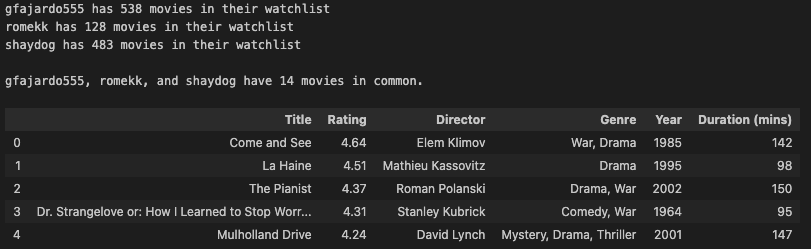
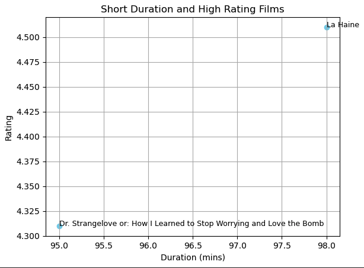

# letterboxd-watchlist

If you and your friends are on Letterboxd, and actviely use the watchlist feature, this is a great way to figure out what movie you can watch together! 

To get movies that are common in all of your watchlists, open the ```common_watchlist.ipynb``` notebook, and change the lines below (found at the top of the notebook) to the user(s) you want to get a common watchlist for:

```python
# define users - can do as many as you want - can also do this for 1 user
USERS = ['gfajardo555', 'romekk', 'shaydog'] ## CHANGE ME
``` 
Then, run the ```common_watchlist.ipynb``` notebook. 

---

Example output:



## Selecting High Rated and Low Duration movies

If you want to find a movie that isn't too long and is highly rated, you can use the ```plot_low_dur_high_rate_movies``` function!

Example: 

```python
def plot_low_dur_high_rate_movies(common_movies_df, min_rating=4.2, max_duration=100, font_size=9, save_dir=None):
```


